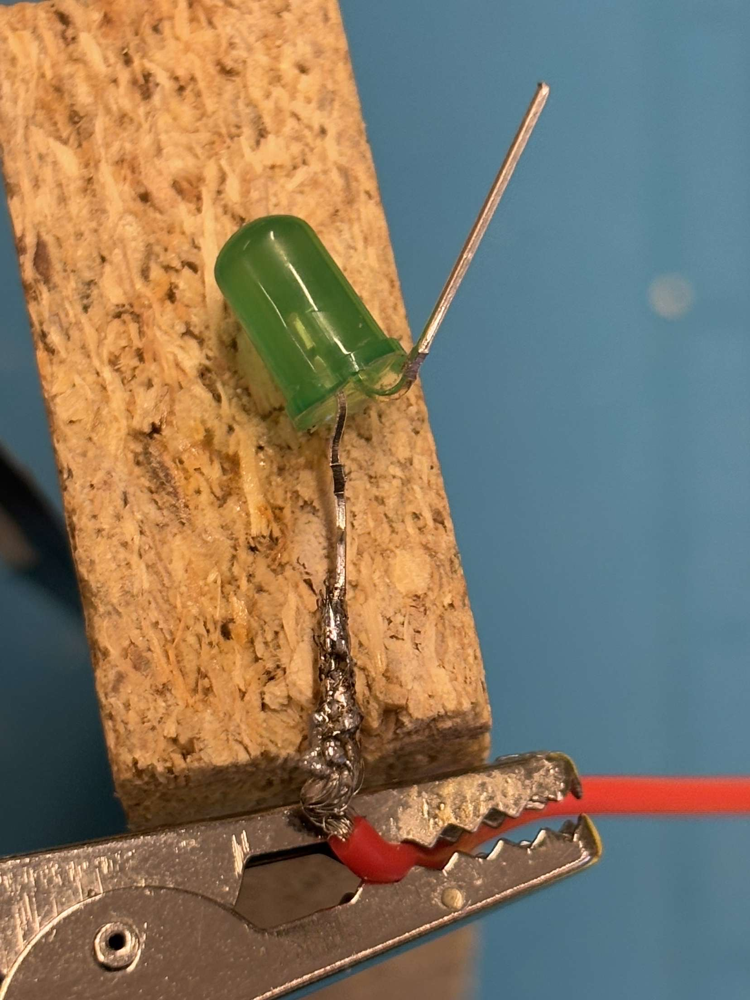

# H24_Gameoflife
Höfundir: Aronas Sliuzas, Benedikt Bergmann Hákonarson, Benedikt Aron Kristjánsson og Þorvaldur Hörður Villysson

## Lýsing og Leiðbeningar
Game of life er borðspil þar sem að leikmen (2-4) draga fyrst vinnuspil sem segir til hversu mikin pening leikmen fá og síðan ýtta leikmenn á taka og fara áfram á spilinu samkvæmt tening sem er kastaður með þess að ýtta á græna takkan sem er staðsettur á spilinu. Leikmenn ferðast eftir spilinu og lenda á alskonar reittum t.d ? þar sem að maður dregur spil sem er annahvort gott eða slæmt síðan er $ sem gefur manni pening eftir vinnu spili og síðan er ! sem maður þarf að borga skatta sem eru merktir á spilum. Leikurinn klárast þegar að allir hafa komist á seinasta reidd og sá sem hefur mesta pening er siguverari. Sá fyrsti til að komast í endan fær 100k sá næsti 50k sá þriðji fær 25k og seinasti 0k.

## Inkscape model

## Kóði

[kodi](main.py)

## Lóðun

## útlit spilar

